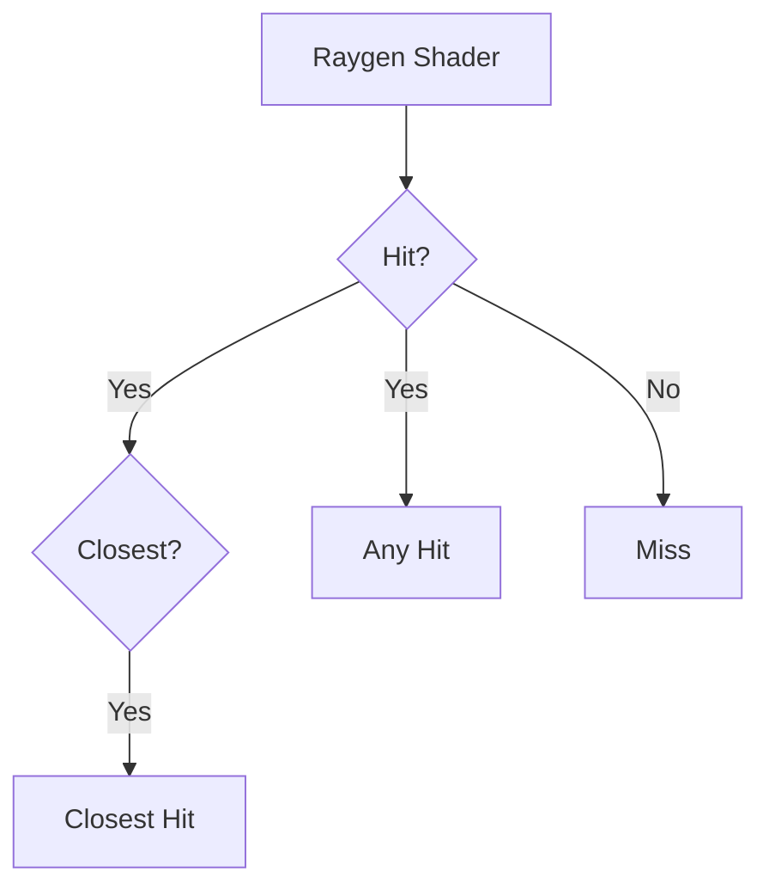

# レイトレーシングパイプラインにおけるシェーダ

レイトレーシングパイプラインでは、通常のグラフィックスパイプラインとは異なるシェーダを使います。

1. Raygenシェーダ：
   レイトレーシングパイプラインのエントリーポイントとなるシェーダ
2. Missシェーダ：
   レイがヒットしなかった場合に実行されるシェーダ
3. Closest Hitシェーダ：
   レイがヒットした点のうち、最も近い点で実行されるシェーダ
4. Any Hitシェーダ：
   レイがヒットした全ての点で実行されるシェーダ
5. Intersectionシェーダ：
   三角ポリゴン以外のアプリケーションで定義された自由な形状との交差判定を行うシェーダ
6. Callableシェーダ：
   その他のシェーダから呼び出されるシェーダ

フローとしては以下のようになります。ごちゃごちゃするので書いていませんが、MissやHit系シェーダの後はRaygenシェーダに戻ります。



# シェーダの作成

ここで一度メインのプログラムを離れ、シェーダを書いていきます。

今回使用するシェーダは基本となる以下の3つです。

1. Raygenシェーダ：
2. Closest Hitシェーダ：
3. Missシェーダ：

まずはプロジェクトに`shaders`フォルダを作成し、その下にシェーダファイルを置くこととします。

```
project/
 - vcpkg.json
 - CMakeLists.txt
 - code/
   - main.cpp
   - vkutils.hpp
 - shaders/
   - raygen.rgen (new)
   - closesthit.rchit (new)
   - miss.rmiss (new)
```

## Raygenシェーダ

Raygenシェーダはレイトレーシングパイプラインの起点となるシェーダです。レイを飛ばす方向を決め、トレースを開始します。

```glsl:raygen.rgen
#version 460
#extension GL_EXT_ray_tracing : enable

layout(location = 0) rayPayloadEXT vec3 payload;

layout(binding = 0) uniform accelerationStructureEXT topLevelAS;
layout(binding = 1, rgba8) uniform image2D image;

void main()
{
    vec2 uv = (vec2(gl_LaunchIDEXT.xy) + vec2(0.5)) / vec2(gl_LaunchSizeEXT.xy);
    vec3 origin = vec3(0, 0, 5);
    vec3 target = vec3(uv * 2.0 - 1.0, 2);
    vec3 direction = normalize(target - origin);

    payload = vec3(0.0);

    traceRayEXT(
        topLevelAS,
        gl_RayFlagsOpaqueEXT,
        0xff,       // cullMask
        0, 0, 0,    // sbtRecordOffset, sbtRecordStride, missIndex
        origin,
        0.001,      // tMin
        direction,
        10000.0,    // tMax
        0           // payloadLocation
    );

    imageStore(image, ivec2(gl_LaunchIDEXT.xy), vec4(payload, 0.0));
}
```

レイトレーシング用のシェーダでは、先頭で `GL_EXT_ray_tracing` という拡張機能を有効化します。`gl_LaunchIDEXT` と `gl_LaunchSizeEXT` という変数を使って、シェーダの起動IDとサイズを取得し、レイの原点と方向を計算しています。

`traceRayEXT()` 関数で、バインドした `accelerationStructureEXT` に対してレイを飛ばし、`rayPayloadEXT` に指定したペイロード変数で他のシェーダによる結果を受け取ります。今回は単純に色を表す `vec3` を受け取りますが、ペイロードの型はユーザ定義の構造体でも構いません。データの典型例としては、放射輝度、ヒットした点の位置、法線、そこまでにレイが進んだ距離などが挙げられるでしょうか。

最後に、`imageStore()` 関数で色を書き込みます。通常のグラフィックスパイプラインにおけるフラグメントシェーダは、シェーダの出力変数に色を入れていましたが、レイトレーシングでは画像に直接書き込みます。そのため、画像をStorage imageとしてバインドする必要があります。

## Closest Hitシェーダ

Closest Hitシェーダはレイがヒットした点のうち、最も近い点で実行されるシェーダです。今回は三角形内の重心座標を計算して`payload`に保存します。

```glsl:closesthit.rchit
#version 460
#extension GL_EXT_ray_tracing : enable

layout(location = 0) rayPayloadInEXT vec3 payload;
hitAttributeEXT vec3 attribs;

void main()
{
    vec3 baryCoords = vec3(1.0 - attribs.x - attribs.y, attribs.x, attribs.y);
    payload = baryCoords;
}
```

このシェーダで法線やテクスチャ座標などの情報を取得し、シェーディングを行うことが一般的です。ちなみに、Raygenシェーダだけでなく、Closest hitシェーダからもレイを飛ばすことができます。例えばヒット点から光源に対してシャドウレイを飛ばすことで影を簡単に実装できます。ただし、パイプライン作成時の最大再帰深度を適切に設定する必要があります。

## Missシェーダ

Missシェーダはレイがヒットしなかった場合に実行されるシェーダです。今回は背景色を`payload`に保存します。

```glsl:minn.rmiss
#version 460
#extension GL_EXT_ray_tracing : enable

layout(location = 0) rayPayloadInEXT vec3 payLoad;

void main()
{
    payLoad = vec3(0.0, 0.5, 0.2);
}
```

# シェーダのコンパイル

今回は glslangValidator を使ってGLSLをSPIR-V（読み方：スピアブイ）形式にコンパイルします。

Windows環境では、`shaders`ディレクトリに以下のようなバッチファイルを作ります。異なるプラットフォームの場合は適宜読み替えて下さい。

```sh:compile.bat
@echo off
set GLSLANG_VALIDATOR=%VULKAN_SDK%/Bin/glslangValidator.exe

for %%s in (raygen.rgen closesthit.rchit miss.rmiss) do (
    %GLSLANG_VALIDATOR% %%s -V -o %%s.spv --target-env vulkan1.2
)
```

これを実行して3つの`spv`ファイルが作成されていることを確認します。

```sh
project/
  - shaders/
    - raygen.rgen
    - closesthit.rchit
    - miss.rmiss
    - raygen.rgen.spv (new)
    - closesthit.rchit.spv (new)
    - miss.rmiss.spv (new)
```

# シェーダモジュールとシェーダステージ

ではC++に戻ります。

それぞれのシェーダを読み込んだのち、`vk::ShaderModule`を作成します。シェーダは複数あるので配列にしておきます。パイプラインを作成する際に必要となるその他の情報も配列で用意しておきます。

```cpp
class Application {
    // ...
    std::vector<vk::UniqueShaderModule> shaderModules;
    std::vector<vk::PipelineShaderStageCreateInfo> shaderStages;
    std::vector<vk::RayTracingShaderGroupCreateInfoKHR> shaderGroups;
    // ...
};
```

シェーダを読み込んでいきます。まず、`prepareShaders()`関数を作成し、`initVulkan()`から呼び出します。先ほど追加したメンバ変数をリサイズしておきます。

```cpp
void initVulkan() {
    // ...
    prepareShaders();
}

void prepareShaders() {
}
```

3つのシェーダで似たような処理を行うので、ヘルパー関数を作成してまとめておきます。シェーダモジュールとシェーダステージは通常のグラフィックスパイプラインと同様です。

```cpp
void addShader(uint32_t shaderIndex,
                const std::string& filename,
                vk::ShaderStageFlagBits stage) {
    shaderModules[shaderIndex] =
        vkutils::createShaderModule(*device, SHADER_DIR + filename);
    shaderStages[shaderIndex].setStage(stage);
    shaderStages[shaderIndex].setModule(*shaderModules[shaderIndex]);
    shaderStages[shaderIndex].setPName("main");
}

void prepareShaders() {
    std::cout << "Prepare shaders\n";

    // Create shader modules and shader stages
    uint32_t raygenShader = 0;
    uint32_t missShader = 1;
    uint32_t chitShader = 2;
    shaderStages.resize(3);
    shaderModules.resize(3);

    addShader(raygenShader, "raygen.rgen.spv",
              vk::ShaderStageFlagBits::eRaygenKHR);
    addShader(missShader, "miss.rmiss.spv",
              vk::ShaderStageFlagBits::eMissKHR);
    addShader(chitShader, "closesthit.rchit.spv",
              vk::ShaderStageFlagBits::eClosestHitKHR);
}
```

# シェーダグループ

シェーダグループは、レイトレーシングパイプラインの作成時に必要となります。

レイトレーシングパイプラインでは、
後述するシェーダバインディングテーブルと連携して、レイトレーシング中にどのシェーダを呼び出すかを指定するために使います。
複数のシェーダが1つのグループとしてまとめられることがあります。Raygen、Miss、Hit、Callableの最大4つのグループがありますが、今回はCallableは使わないのでRaygen、Miss、Hitの3つのグループを作成します。

## Raygenグループ

RaygenグループはRaygenシェーダを1つだけ保持するグループです。そして、Raygenグループはパイプラインに1つだけ含めることができます。Raygenシェーダはエントリポイントであるため、1つしか存在できません。

## Missグループ

MissグループはMissシェーダを1つだけ保持するグループです。Missグループはパイプラインに複数含めることができます。例えば、空の色を取得するためのMissシェーダと、シャドウレイがヒットしなかった場合に呼び出すMissシェーダを分けることができます。

GLSLの`traceRayEXT()`関数の引数に渡した`missIndex`で、どのMissグループを呼び出すかを指定します。

```glsl
void traceRayEXT(
    // ...
    uint missIndex,
    // ...
);
```

## Hitグループ

HitグループはClosest Hit、Any Hit、Intersectionシェーダをそれぞれ最大1つ保持するグループです。全部そろっている必要はまったくありません。Hitグループはパイプラインに複数含めることができます。例えば、インスタンスごとに異なるマテリアル（シェーダ）を割り当てることができます。

TODO: 呼び出しの説明追加

```glsl
void traceRayEXT(
    // ...
    uint sbtRecordOffset,
    uint sbtRecordStride,
    // ...
);
```

## シェーダグループの作成

TODO: 説明追加

```cpp
void prepareShaders() {
    // ...


    // Create shader groups
    uint32_t raygenGroup = 0;
    uint32_t missGroup = 1;
    uint32_t hitGroup = 2;
    shaderGroups.resize(3);

    // Raygen group
    shaderGroups[raygenGroup].setType(
        vk::RayTracingShaderGroupTypeKHR::eGeneral);
    shaderGroups[raygenGroup].setGeneralShader(raygenShader);
    shaderGroups[raygenGroup].setClosestHitShader(VK_SHADER_UNUSED_KHR);
    shaderGroups[raygenGroup].setAnyHitShader(VK_SHADER_UNUSED_KHR);
    shaderGroups[raygenGroup].setIntersectionShader(VK_SHADER_UNUSED_KHR);

    // Miss group
    shaderGroups[missGroup].setType(
        vk::RayTracingShaderGroupTypeKHR::eGeneral);
    shaderGroups[missGroup].setGeneralShader(missShader);
    shaderGroups[missGroup].setClosestHitShader(VK_SHADER_UNUSED_KHR);
    shaderGroups[missGroup].setAnyHitShader(VK_SHADER_UNUSED_KHR);
    shaderGroups[missGroup].setIntersectionShader(VK_SHADER_UNUSED_KHR);

    // Hit group
    shaderGroups[hitGroup].setType(
        vk::RayTracingShaderGroupTypeKHR::eTrianglesHitGroup);
    shaderGroups[hitGroup].setGeneralShader(VK_SHADER_UNUSED_KHR);
    shaderGroups[hitGroup].setClosestHitShader(chitShader);
    shaderGroups[hitGroup].setAnyHitShader(VK_SHADER_UNUSED_KHR);
    shaderGroups[hitGroup].setIntersectionShader(VK_SHADER_UNUSED_KHR);
}
```


以上でこの章は完了です。

[ここまでのC++コード(06_create_shader.hpp)](https://github.com/nishidate-yuki/vulkan_raytracing_from_scratch/blob/master/code/06_create_shader.hpp)

[シェーダファイル](https://github.com/nishidate-yuki/vulkan_raytracing_from_scratch/tree/master/shaders)
